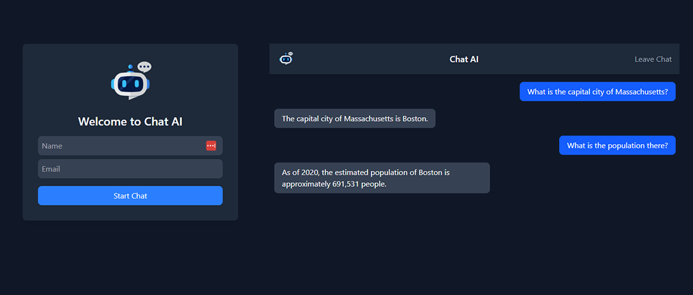

# 🤖 Chat AI UI
[English](README.md) | [Русский](README.ru.md)

<a href="https://vue-chat-ai-ui.vercel.app/" target="_blank">🚀 Демо-версия</a>

Современный и отзывчивый интерфейс для приложения Chat AI. Это приложение на **Vue.js 3**, которое обеспечивает удобное взаимодействие с Gemini AI, используя Stream Chat для обмена сообщениями в реальном времени и Neon PostgreSQL для хранения данных.



## ✨ Особенности

- 💬 **Чат в реальном времени**: Работает на базе Stream Chat API.
- 🧠 **Интеграция с ИИ**: Глубокая интеграция с Google Gemini для умных ответов.
- ⚡ **Производительность**: Использование Vue 3 и Vite для мгновенной загрузки.
- 🛡️ **Безопасность**:
    - Защита от XSS атак с помощью DOMPurify.
    - Безопасная маршрутизация API на основе переменных окружения.
    - Надежная обработка сетевых ошибок.

## 🛠 Технологический стек

*   🟢 **Vue.js 3** — Core Framework
*   ⚡ **Vite** — Build Tool
*   🐘 **PostgreSQL (Neon)** — Database
*   ✨ **Google Gemini** — AI Engine
*   💬 **Stream Chat** — Messaging API

## 🚀 Быстрый старт

### 1. Клонирование репозитория
```bash
git clone https://github.com
cd vue-chat-ai-ui
```

### 2. Установка зависимостей
```bash
npm install
```

### 3. Настройка окружения
Создайте файл `.env` в корневой директории:
```env
# Для разработки
VITE_API_URL=http://localhost:3000

# Для продакшена
VITE_API_URL=https://your-api-domain.com
```

### 4. Запуск сервера разработки
```bash
npm run dev
```

## 🏗 Сборка для продакшена

```bash
npm run build
```
Готовые файлы для деплоя появятся в папке `dist/`.

## 🔗 Связанные проекты
Для работы этого фронтенда необходим **Node.js Express Backend**.
<a href="https://github.com/DavidSulava/node-chat-ai-api" target="_blank">👉 Ссылка на API бэкенда</a>
